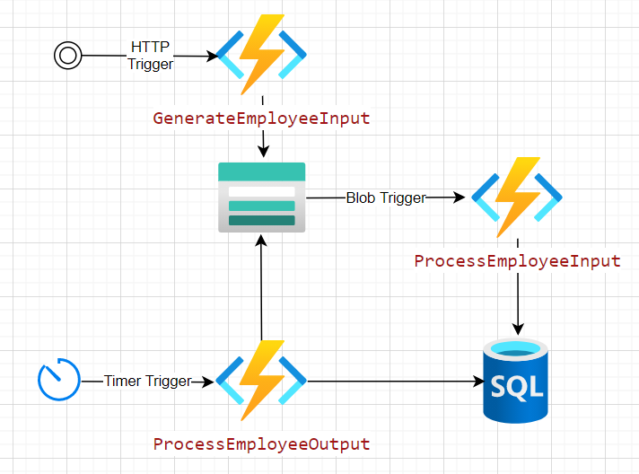

# File Imports and Exports

An example of blob imports and exports using C# Azure Functions.



1. A new employee file is dropped in the employee-input storage container.
    1. A helper HTTP function has been created to generate a new Employee file for testing at POST /api/customers?count=10
1. The ProcessEmployeeInput function is triggered for each file in employee-input.
    1. The file is parsed for each employee.
    1. Each employee record is saved to the database.
1. The ProcessEmployeeOutput function is triggered every 5 minutes.
    1. Retrieves all the employee records that have changed since the last export.
    1. If there are records, they are saved as a file to the employee-output storage container.
    1. A new record is written to the EmployeeExports table.

## Setup

The **Data/schema.sql** script will set up the initial database schema.

The following settings are needed in local.settings.json file:

```json
{
  "IsEncrypted": false,
  "Values": {
    "AzureWebJobsStorage": "[storage_connection_string]",
    "FUNCTIONS_WORKER_RUNTIME": "dotnet",
    "StorageConnection": "[storage_connection_string]",
    "SqlConnection": "[sql_server_connection_string]"
  }
}
```

## Running

The **test.rest** file can be used in VS Code along with the [Rest Client Extension](https://marketplace.visualstudio.com/items?itemName=humao.rest-client) for making HTTP calls to the locally running Function App.
